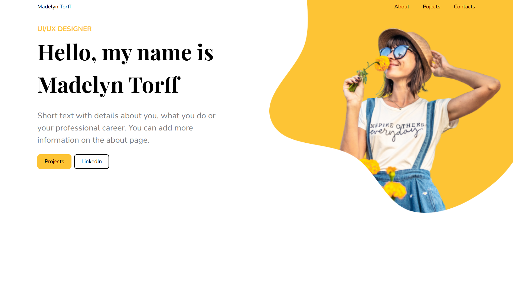

# Madelyn Torff Landing - Portfolio Project (Mario De Molina)

Landing page desarrollada como reto de maquetación (CodeOp). Este repositorio es un **proyecto de portfolio** para demostrar HTML/CSS (Tailwind) y responsive layout.

## Demo
https://dmlean.github.io/madelyn-torff-landing/

## ¿Qué aporta?
- Maquetación responsive (desktop/mobile).
- Estructura limpia por secciones.
- Uso de utilidades Tailwind para layout y espaciado.
- Buenas prácticas básicas: README, .gitignore, deploy con GitHub Pages.
- Maquetación responsive con estructura semántica (header/nav/sections) y layout con Tailwind utilities.

## Tecnologías
- HTML5
- CSS3
- Tailwind CSS

## Cómo ejecutarlo en local
Opción simple:
- Abre index.html en el navegador.

Si quieres compilar Tailwind (si aplica según tu package.json):
- 
npm install
- 
npm run build (o el script equivalente)

## Créditos
- Diseño/brief: challenge de CodeOp (Madelyn Torff landing).